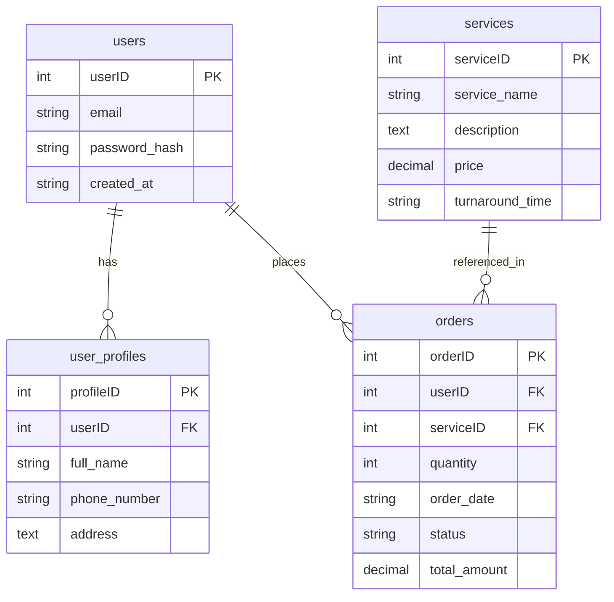

# Waxxed on Wax Vinyl Club

This site is designed as a vinyl collector's safe haven. Members can interact, view vinyl collections from our catalog, and request restoration services for older vinyl records. The UI features a relaxed aesthetic—utilizing warm browns, golden yellows, and dark hues to create a laid-back, lounge-inspired atmosphere rather than a bright or high-contrast interface.

---

## Technology Stack

* **Frontend:** React, HTML5, CSS3, JavaScript (ES6+)
* **Backend:** Node.js, Express.js
* **Database:** MongoDB (MongoDB Native Driver)
* **Utilities:** CORS, Express List Endpoints, Nodemon

---

## User Stories

1. **As a vinyl enthusiast**, I want to browse available vinyl records and restoration services so that I can care for and grow my collection.
2. **As a club member**, I want to create an account and log in securely to request specialized restoration services.
3. **As a user**, I want a calm, relaxed visual aesthetic (warm dark tones) that feels like an authentic vinyl lounge.
4. **As an admin/developer**, I want a structured backend API to manage members, service listings, and service requests seamlessly.

---

## 🗄️ Database Entity-Relationship Diagram (ERD)


#### 2. Service Schema (`models/Service.js`)

```javascript
const mongoose = require('mongoose');

const ServiceSchema = new mongoose.Schema(
  {
    serviceName: {
      type: String,
      required: [true, 'Please provide a service name'],
      trim: true
    },
    description: {
      type: String,
      required: [true, 'Please provide a description']
    },
    price: {
      type: String,
      required: [true, 'Please provide a price']
    },
    turnaround: {
      type: String,
      required: [true, 'Please provide estimated turnaround time']
    }
  },
  { timestamps: true }
);

module.exports = mongoose.model('Service', ServiceSchema);

```
// Database initialization & collection seeding
db = db.getSiblingDB('waxxed_db');

// Create collections
db.createCollection('users');
db.createCollection('services');

// Seed Services Collection
db.services.insertMany([
  {
    serviceName: 'Deep Washing (1–5 Vinyls)',
    description: 'Ultrasonic and deep-groove cleaning for small batches. Eliminates surface noise, dust, and light smudges.',
    price: '$25',
    turnaround: '24–48 Hours',
    createdAt: new Date()
  },
  {
    serviceName: 'Deep Washing (6+ Vinyls)',
    description: 'Bulk deep cleaning for larger collections. Complete groove restoration with anti-static inner sleeve upgrades included.',
    price: '$45+',
    turnaround: '2–3 Days',
    createdAt: new Date()
  },
  {
    serviceName: 'Premier Restoration',
    description: 'Specialized intensive care for heavily soiled, mold-affected, or rare vintage pressings requiring multi-stage hand-restoration.',
    price: '$60',
    turnaround: '3–5 Days',
    createdAt: new Date()
  }
]);


## Database Architecture (MongoDB)

The project connects to a MongoDB database named `vinyl_club_DB` housing three core collections:

* **`members`**: Stores user profiles, authentication details, and membership credentials.
* **`services`**: Contains the catalog of restoration services offered.
* **`service_orders`**: Relational junction collection connecting members to their booked restoration requests.

* ## 🍃 MongoDB Setup & Schemas

**Database Name:** `waxxed_db`  
**Collections:** `users`, `services`

---

### Mongoose Schema Definitions (`models/`)

#### 1. User Schema (`models/User.js`)

```javascript
const mongoose = require('mongoose');

const UserSchema = new mongoose.Schema(
  {
    name: {
      type: String,
      required: [true, 'Please provide a full name'],
      trim: true
    },
    email: {
      type: String,
      required: [true, 'Please provide an email address'],
      unique: true,
      lowercase: true,
      trim: true
    },
    password: {
      type: String,
      required: [true, 'Please provide a password'],
      minlength: 6
    }
  },
  { timestamps: true }
);

module.exports = mongoose.model('User', UserSchema);

```javascript
// Example MongoDB Native Driver Connection (server/config/db.js)
import { MongoClient } from 'mongodb';

const url = process.env.MONGODB_URI || 'mongodb://localhost:27017';
const dbName = 'vinyl_club_DB';

let dbInstance;

export const connectDB = async () => {
  if (dbInstance) return dbInstance;
  const client = new MongoClient(url);
  await client.connect();
  dbInstance = client.db(dbName);
  return dbInstance;
};

