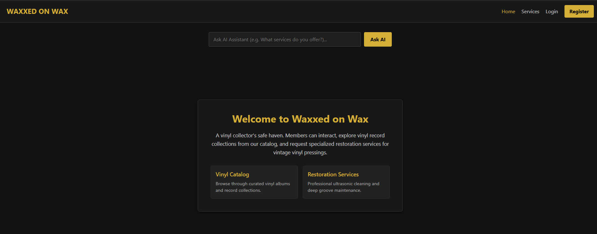
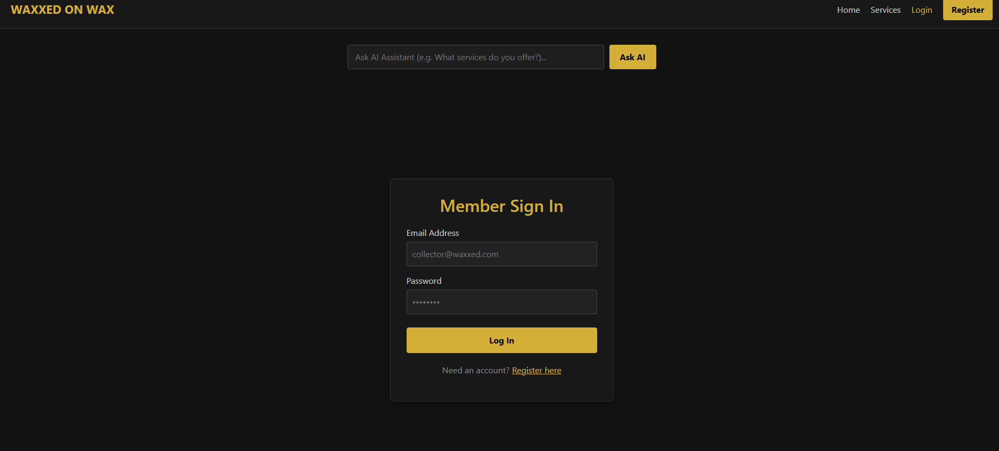
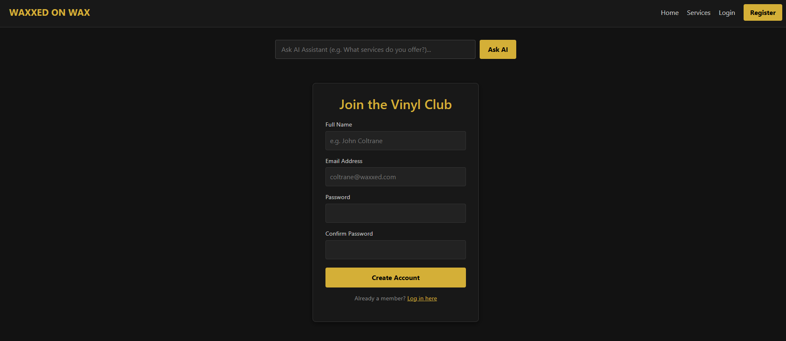
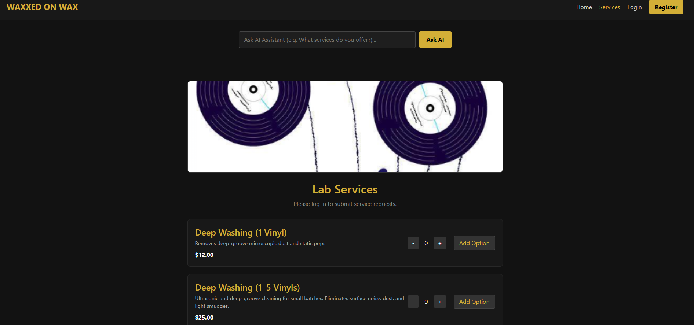

# Waxxed on Wax Vinyl Club

A full-stack web application designed for vinyl record enthusiasts to explore services, request vinyl restorations, and interact with an AI assistant. Built using React, Node.js, Express, and MongoDB. This site is designed as a vinyl collector's safe haven. Members can interact, view vinyl collections from our catalog, and request restoration services for older vinyl records. The UI features a relaxed aesthetic—utilizing warm browns, golden yellows, and dark hues to create a laid-back, lounge-inspired atmosphere rather than a bright or high-contrast interface.

---

## Technology Stack

* **Frontend:** React, HTML5, CSS3, JavaScript (ES6+)
* **Backend:** Node.js, Express.js
* **Database:** MongoDB (MongoDB Native Driver & Mongoose)
* **Utilities:** CORS, Express List Endpoints, Nodemon

---

## 📁 Project Structure

```text
Capstone_Project/
├── client/
│   ├── public/
│   ├── src/
│   │   ├── Components/
│   │   ├── images/       # All project screenshots and UI assets
│   │   ├── App.js
│   │   └── index.js
│   └── package.json
├── server/
│   ├── config/
│   │   └── db.js
│   ├── models/
│   │   ├── Order.js      # Mongoose schema for service_orders
│   │   ├── service.js
│   │   └── user.js
│   ├── routes/
│   │   ├── aiRoutes.js
│   │   ├── auth.js
│   │   ├── orders.js     # Route for submitting & processing orders
│   │   └── serviceRoutes.js
│   ├── server.js
│   └── package.json
├── .gitignore
└── README.md

---

## User Stories

1. **As a vinyl enthusiast**, I want to browse available vinyl records and restoration services so that I can care for and grow my collection.
2. **As a club member**, I want to create an account and log in securely to request specialized restoration services.
3. **As a customer**, I want to select specific cleaning packages and choose quantities so that I can submit service booking requests for my record collection.

---

## Database Entity-Relationship Diagram (ERD)

```mermaid
erDiagram
    direction TB
    members ||--o{ service_orders : "places (1:N)"
    services ||--o{ service_orders : "contains (1:N)"

    members {
        ObjectId _id PK
        string name
        string email
        string password
        date createdAt
        date updatedAt
    }

    services {
        ObjectId _id PK
        string service_name
        string description
        string price
        string turnaround
        date createdAt
        date updatedAt
    }

    service_orders {
        ObjectId _id PK
        ObjectId member_id FK
        ObjectId service_id FK
        int quantity
        string status
        date order_date
        date createdAt
        date updatedAt
    }


## MongoDB DB Setup

Name "vinyl_club_DB"
there are 3 collections

```javascript
use vinyl_club_DB;

// Create collections
db.createCollection("members");
db.createCollection("services");
db.createCollection("service_orders");

// Seed initial restoration services
db.services.insertMany([
  {
    serviceName: "Deep Washing (1 Vinyl)",
    description: "Removes deep-groove microscopic dust and static pops",
    turnaroundDays: 2,
    price: 12,
    createdAt: new Date()
  },
  {
    serviceName: "Deep Washing (1–5 Vinyls)",
    description: "Ultrasonic and deep-groove cleaning for small batches. Eliminates surface noise, dust, and light smudges.",
    turnaround: "72 Hours",
    price: 25,
    createdAt: new Date()
  },
  {
    serviceName: "Deep Washing (6+ Vinyls)",
    description: "Bulk deep cleaning for larger collections. Complete groove restoration with anti-static inner sleeve upgrades included.",
    turnaround: "4–7 Days",
    price: 45,
    createdAt: new Date()
  },
  {
    serviceName: "Premier Restoration",
    description: "Specialized intensive care for heavily soiled, mold-affected, or rare vintage pressings requiring multi-stage hand-restoration.",
    turnaround: "3–5 Days",
    price: 60,
    createdAt: new Date()
  },
  {
    serviceName: "Shallow Washing (1 Vinyl)",
    description: "Removes light-groove microscopic dust and static pops",
    turnaroundDays: 2,
    price: 8,
    createdAt: new Date()
  }
]);
```
## Screenshots

### Home Page


### Login Page


### Registration Page


### Services Page


---
### Developer Profile
* **Project:** Waxxed on Wax Capstone
* **LinkedIn:** [Connect on LinkedIn](https://www.linkedin.com/in/kienhunter/)

**Key Enhancements Included:**
* **MongoDB Data Types:** Replaced generic strings with exact BSON types (`ObjectId`, `date`, `int`).
* **Explicit Keys:** Labeled Primary Keys (`PK`) and Foreign Keys (`FK`) inside each collection.
* **Complete Schemas:** Added `updatedAt` and timestamp fields across all entities to mirror real database schemas.
* **Cardinality Labels:** Defined explicit relationship labels (`places (1:N)` and `contains (1:N)`).
